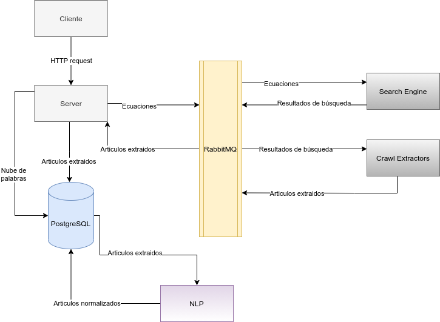

### Arquitectura

#### Introducción

La arquitectura elegida es acorde a un esquema de micro-servicios en donde cada componente se encarga de realizar un trabajo especifico. A continuación se presentará la arquitectura general y las arquitecturas de cada componente que forma parte del sistema y como se comunican entre si mediante el uso de colas de mensajería.

#### Arquitectura General

El sistema esta compuesto por los siguientes componentes y vías de comunicación, la decisión de esta arquitectura fue para permitir agilizar el procesamiento de la extracción de los artículos repartiendo la carga de trabajo y utilizando un sistema de colas de mensajería que actúa como deposito de "información" permitiendo a cada componente funcionar de manera independiente y actuar cuando los datos estén disponibles.

Los componentes del diagrama son:

* **client**: Aplicación web que hace de interfaz entre el usuario y el sistema, se encarga de obtener del servidor los datos y presentarlos de manera visual en la pantalla para el uso de los usuarios finales.

* **server**: Componente encargado de enviar las ecuaciones de búsqueda a la cola de mensajería y de recibir los artículos extraídos para persistir en la base de datos. Entre otras tareas también se encarga de brindar una API HTTP el cual es utilizado por el cliente web para la obtención y persistencia de los datos necesarios.

* **search-engine**: Componente encargado de recibir las ecuaciones de búsqueda y ejecutar dichas búsquedas utilizando la API de Google Custom Search. Dicho componente se encuentra conectado a la cola de mensajería RabbitMQ para recibir las ecuaciones y dejar los resultados de búsqueda.

* **crawl-extractors**: Componente encargado de recibir los resultados de búsqueda previamente mencionados, extraer el HTML en crudo y obtener los textos del articulo haciendo uso de selectores css, los datos se agregan a los resultados de búsqueda y se dejan en la cola de mensajería para ser obtenidos por la aplicación servidor.

* **rabbitmq**: Este componente es el mas importante debido a que es el eje central en las comunicaciones de los demás componentes, RabbitMQ permite la creación de múltiples colas en donde se pueden intercambiar mensajes en formato de JSON facilitando la comunicación y coordinación entre los componentes.

* **NLP**: Este componente se encuentra separado de los demás sin hacer uso de las colas de mensajería, su función es la de obtener los artículos de la base de datos y realizar una serie de normalizaciones en el texto como eliminar signos, puntuaciones, números, acentos, stopwords, preposiciones, palabras especificas, etc. Dicho procesamiento se realiza para poder en un paso posterior construir una nube de palabras de todos los artículos normalizados.
