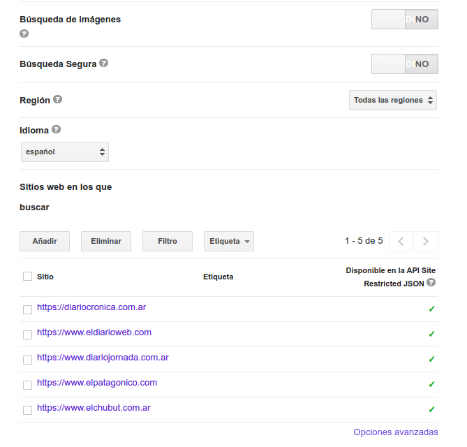

### Requisitos previos

* NodeJS 10.X o superior [Página de descarga](https://nodejs.org/es/)
* RabbitMQ [Página de descarga](https://bintray.com/rabbitmq/debian/rabbitmq-server)
* PostgreSQL [Página de descarga](https://www.postgresql.org/download/)
* AdonisJS [Página de descarga](https://adonisjs.com/)
* VueJS [Página de descarga](https://cli.vuejs.org/guide/installation.html)
* (Opcional) forever: `npm install -g forever`

#### Instalar Python 3
El proyecto hace uso de python 3.8 para el funcionamiento del NLP, para ello deberá instalarlo en su sistema.

1. Instalar python 3: `apt-get install python3.8`
2. Instalar pip: `apt-get install python3-pip`
3. Actualizar pip: `python3 -m pip install --upgrade pip`
4. Instalar virtualenv: `pip3 install virtualenv`
5. En la carpeta `nlp` crear el virtualenv con el comando: `virtualenv venv`
6. En caso de error "setuptools pip failed with error code error" ejecutar: `pip3 install --upgrade setuptools`
7. (Opcional) Instalar spacy: `pip3 install spacy`
8. (Opcional) Instalar el modelo en español de spacy: `python -m spacy download es_core_news_lg`

#### Configurar Google CSE

El sistema hace uso del buscador personalizado de Google, para ello deberá crear un buscador en [https://cse.google.com/cse/all](https://cse.google.com/cse/all).

Al crear un buscador, Google le brindará un ID de buscador único junto con su key necesarios para poder hacer uso del mismo desde llamadas http. Dichos datos deben ser incorporados en el .env de `search-engine` para poder ejecutar las búsquedas.

Al acceder a la configuración del buscador, podrá ver varios parámetros como el nombre, descripción, idioma, etc. Una configuración muy importante es incorporar los sitios web en donde se realizaran las búsquedas para que así se pueda pre-filtrar los resultados por sitios específicos.

**IMPORTANTE:** si usa la versión gratuita, solo podrá realizar 100 búsquedas por día, en cambio si posee la versión paga, podrá realizar una mayor cantidad de búsquedas. Este factor es importante ya que determina cual es el limite de búsquedas diarias que deberá configurar en la base de datos (ver las siguientes secciones sobre como se configura).

Actualmente los sitios con los que se trabaja son:

* https://diariocronica.com.ar
* https://www.eldiarioweb.com
* https://www.diariojornada.com.ar
* https://www.elpatagonico.com
* https://www.elchubut.com.ar
* https://radio3cadenapatagonia.com.ar
* https://diariolaportada.com.ar
* https://www.red43.com.ar

#### Configurar RabbitMQ

Las aplicaciones hacen uso de RabbitMQ para comunicarse entre si, para ello deberá utilizar los siguientes comandos (quizás como root):

1. Crear el virtualhost `tesina` con el comando: `rabbitmqctl add_vhost tesina`
2. Verificar que efectivamente el virtualhost fue creado con: `rabbitmqctl list_vhosts`
3. Agregar el usuario de RabbitMQ por defecto al virtualhost con todos los permisos: `rabbitmqctl set_permissions -p tesina guest ".*" ".*" ".*"`

#### Instalación

1. Clonar el proyecto `https://github.com/emanuelbalcazar/tesina.git`.
2. Moverse a la carpeta raiz del proyecto `cd tesina`.
3. Ejecutar el comando `./tesina.sh install` para instalar las dependencias de nodejs en todas las aplicaciones.
4. En el caso del nlp es diferente, debera moverse a la carpeta **nlp** y ejecutar los siguientes comandos:

- Activar el virtualenv con: `source venv/bin/activate`
- Instalar las dependencias con: `pip install -r requirements.txt`
- Descargar las librerias y corpus necesarios con: `python download.py`

5. Configurar archivos .env

Crear el archivo .env en las carpetas `server`, `client`, `search-engine` y `crawl-extractors`, utilizar el archivo `.env.example` como ejemplo completando los datos indicados incluyendo los parametros de conexión a la base de datos, conexión a RabbitMQ y claves de Google CSE previamente obtenidas.
Si todos los datos fueron completados, las aplicaciones deberían poder ejecutarse sin problemas.

6. Configurar los parámetros de conexión del NLP en `nlp/configuration.ini` modificando los datos que sean necesarios para permitir la conexión a la base de datos.
7. Ejecutar el comando `./tesina.sh migrate` para crear las tablas en la base de datos (asegurarse de que los .env sean correctos).
8. Ejecutar el comando `./tesina.sh seed` para cargar la base de datos con los datos iniciales necesarios para el funcionamiento de las aplicaciones.

#### Despliegue

1. Ejecutar el comando `./tesina.sh forever:startall` para levantar todas las aplicaciones con forever.
2. (Opcional) si no desea usar forever, puede ejecutar `npm start` en las carpetas `crawl-extractors`, `search-engine`, `server` y `client`.
3. Para ejecutar el proceso de NLP ver en la siguiente sección.

#### NLP

El modulo de procesamiento de lenguaje general funciona de manera separada al resto de los componentes ya que no se integra al circuito de RabbitMQ. Para ejecutarlo debera hacer los siguientes pasos:

1. Moverse a la carpeta nlp: `cd nlp`
2. Activar el virtualenv: `source venv/bin/activate`
3. Ejecutar el modulo principal con: `python main.py`

El proceso comenzará a recuperar los artículos que NO fueron procesados desde la base de datos y los ira normalizando y persistiendo en la tabla de `normalized_articles` en la base de datos. Cada fila insertada contiene el texto resultante de la normalización así como los pasos intermedios en cada columna.
Al finalizar el proceso debería tener la misma cantidad de artículos normalizados como artículos extraídos en su base de datos.

**AVISO**: este proceso puede demorar bastante tiempo, se normalizan aproximadamente 10 artículos por minuto.

#### Usando screen

Probablemente, usted quiera dejar ejecutando el proceso en background, para ello utilizaremos screen.

1. Instalar screen: `apt-get install screen`
2. Moverse a la carpeta de NLP: `cd nlp`
3. Escribir el comando screen: `screen` para entrar en la consola de screen.
4. Activar el entorno virtual con: `source venv/bin/activate`
5. Ejecutar el archivo main: `python main.py`
6. Salir de screen presionando las teclas: `ctrl` + `A` + `D` al mismo tiempo, a partir de este punto puede cerrar su consola principal.
7. Escriba el comando: `screen -ls` para comprobar que la consola de screen quedo en background
8. Si desea retomar la consola, escriba: `screen -r`

#### Verificación

Para verificar si las aplicaciones están ejecutando, acceda desde el navegador a las siguientes rutas por defecto de las aplicaciones para comprobar si su api rest se encuentra activa.

* Server: http://localhost:8000/
* Search Engine: http://localhost:8001/api/
* Crawl Extractors: http://localhost:8002/api/
* Client: http://localhost:8080

En cualquier caso, las aplicaciones mostraran un mensaje al comenzar su ejecución ya sea indicando que workers están activos o en que puerto estan escuchando, esta es otra manera de verificar que las aplicaciones están ejecutando y lograron conectarse a la base de datos y RabbitMQ.

#### Configuraciones adicionales

Al seguir todos los pasos previos, el servidor creará en la base de datos una tabla de configuraciones relacionadas con el planificador y los request limite para los workers, así como la cantidad de workers disponibles. Estas configuraciones se pueden modificar si lo desea accediendo con el script y comando `./tesina.sh config` en donde puede configurar:

* [requestCount] - Cantidad de request realizados en el dia - un contador que muestra cuantos request se van realizando entre todos los workers, se resetea cuando todos los workers cumplen con su cuota diaria de requests, esta configuración no es necesario que sea modificada.
* [requestLimit] - Cantidad de request limite por dia - utilice esta configuración para setear cuantos request se pueden realizar por cada día, tenga en cuenta es este valor se divide en partes iguales entre todos los workers para definir la cuota de request de cada uno.
* [workers] - Cantidad de workers disponibles - por defecto ya incluye todos los workers del sistema, en caso de incorporar nuevos workers deberá actualizar este valor. Esta configuración es importante ya que es utilizada para dividir la cantidad de request por cada worker por lo que su valor debe ser siempre el correcto.
* [scheduleOnStart] - ¿Iniciar planificador al iniciar el servidor? - esta configuración le permite habilitar o deshabilitar el planificador al iniciar el servidor.
* [scheduleEvery] - Periodicidad del planificador para el envió de ecuaciones - indica en forma de notación crontab cada cuanto el planificador debe enviar las ecuaciones a RabbitMQ para ser ejecutadas, por defecto el planificador debe ejecutar una vez al día cuando los workers hayan acabado su cuota diaria de requests.
* [nextDayCron] - Notacion Cron de ejecución una vez por día - notación que indica en formato de crontab cuando es una ejecución diaria, solo se guarda en caso de necesitar reemplazar el valor del [scheduleEvery] pero por el momento no se hace uso de esta configuración.
* [wordcloudSchedulerOnStart] - ¿Iniciar el planificador de construcción de nubes de palabras? - indica si se debe ejecutar el planificador que levanta los articulos normalizados y los procesa para armar la nube de palabras.
* [wordcloudSchedulerEvery] - Periodicidad del constructor de nubes de palabras - indica la periodicidad con la que se ejecutara el constructor de nube de palabras, por defecto se ejecuta cada 5 minutos procesando un máximo de 50 articulos.
